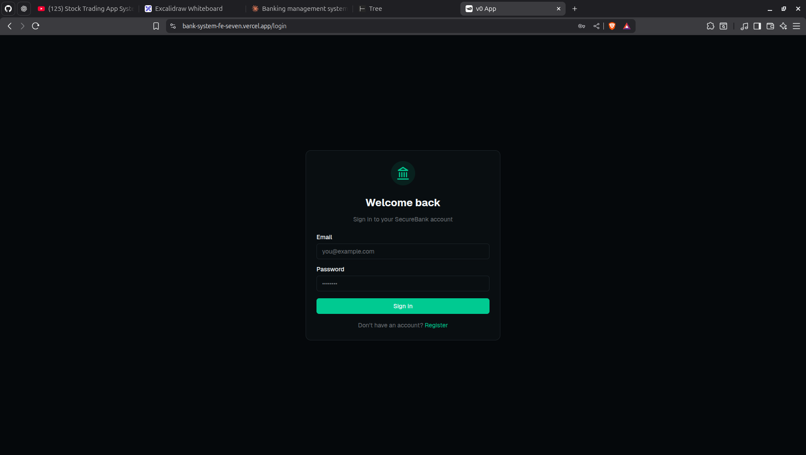
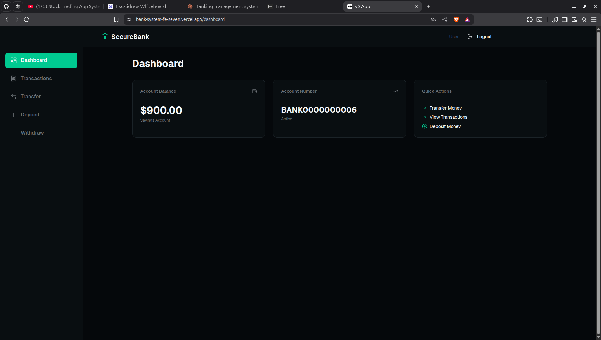
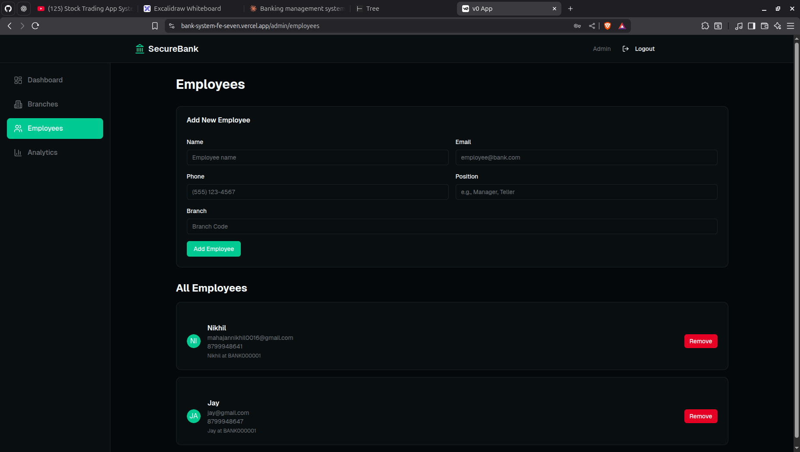
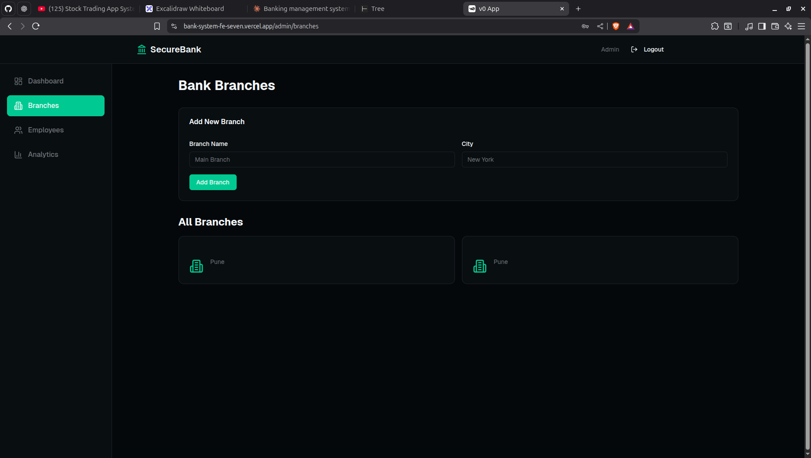

# Banking Management System - Frontend

> A modern, responsive web application for banking operations built with Next.js and React

## Overview

The Banking Management System Frontend is a sophisticated, user-friendly web application that provides a complete banking experience through an intuitive interface. Built with Next.js and styled with Tailwind CSS, it offers seamless interaction with the banking backend API, supporting multiple user roles with role-specific dashboards and features.

This application emphasizes security, performance, and user experience, implementing JWT-based authentication, real-time data fetching with React Query, and a responsive design that works flawlessly across all devices.

## Features

### Authentication & Security
- **Secure Login System** - JWT-based authentication with token management
- **Role-Based Access** - Different interfaces for Admin, Employee, and Customer roles
- **Protected Routes** - Automatic redirection for unauthorized access
- **Session Management** - Automatic token refresh and logout on expiration
- **Password Security** - Secure password input with visibility toggle

### User Dashboards

#### Customer Dashboard
- Account overview with current balance
- Quick access to deposit, withdraw, and transfer funds
- Transaction history with search and filter
- Account statements and downloadable reports
- Profile management and settings

#### Employee Dashboard
- Customer management interface
- Account creation and management
- Transaction processing on behalf of customers
- Customer search and filtering
- Branch-wise customer view

#### Admin Dashboard
- Complete system overview and analytics
- User management (customers, employees)
- Branch management and configuration
- System-wide reports and statistics
- Employee assignment and role management

### Account Management
- View all linked accounts
- Real-time balance updates
- Account details and information
- Account statement generation
- Multiple account support

### Transaction Features
- **Deposit Funds** - Add money to accounts with instant reflection
- **Withdraw Money** - Secure withdrawal with balance validation
- **Transfer Funds** - Inter-account and inter-branch transfers
- **Transaction History** - Comprehensive list with filters (date, type, amount)
- **Transaction Receipt** - Download/print transaction confirmation
- **Search & Filter** - Advanced transaction search capabilities

### Branch Operations
- View all branches
- Branch details and information
- Branch-wise statistics (Admin view)
- Create/edit branches (Admin only)

### Responsive Design
- Mobile-first approach
- Tablet and desktop optimized
- Touch-friendly interface
- Adaptive navigation
- Progressive Web App (PWA) ready

## Tech Stack

| Technology | Purpose | Version |
|------------|---------|---------|
| **Next.js** | React framework with SSR/SSG | 14.x |
| **React** | UI library | 18.x |
| **TypeScript** | Type-safe JavaScript | 5.x |
| **Tailwind CSS** | Utility-first CSS framework | 3.x |
| **shadcn/ui** | Re-usable component library | Latest |
| **Axios** | HTTP client for API requests | 1.6+ |
| **React Query** | Server state management | 5.x |
| **React Hook Form** | Form validation and management | 7.x |
| **Zod** | Schema validation | 3.x |
| **Lucide React** | Icon library | Latest |
| **next-themes** | Dark mode support | Latest |

## Prerequisites

Before you begin, ensure you have the following installed:

- **Node.js 18.x or higher**
  - Verify: `node --version`
- **npm 9.x or higher** or **yarn 1.22+**
  - Verify: `npm --version` or `yarn --version`
- **Git** (for cloning the repository)
- **Backend API** running and accessible
- **Code Editor** (VS Code recommended)

## Installation & Setup

### 1. Clone the Repository

```bash
git clone https://github.com/yourusername/banking-management-frontend.git
cd banking-management-frontend
```

### 2. Install Dependencies

Using npm:
```bash
npm install
```

Using yarn:
```bash
yarn install
```

Using pnpm:
```bash
pnpm install
```

### 3. Configure Environment Variables

Create a `.env.local` file in the root directory:

```env
# API Configuration
NEXT_PUBLIC_API_URL=http://localhost:8080/api
NEXT_PUBLIC_API_TIMEOUT=30000

# App Configuration
NEXT_PUBLIC_APP_NAME=Banking Management System
NEXT_PUBLIC_APP_VERSION=1.0.0

# Feature Flags
NEXT_PUBLIC_ENABLE_DARK_MODE=true
NEXT_PUBLIC_ENABLE_ANALYTICS=false

# Optional: Analytics
NEXT_PUBLIC_GA_TRACKING_ID=your-ga-tracking-id

# Optional: Sentry (Error Tracking)
NEXT_PUBLIC_SENTRY_DSN=your-sentry-dsn
```

### 4. Verify Backend Connection

Ensure your backend API is running and accessible at the configured URL. Test the connection:

```bash
curl http://localhost:8080/api/health
```

### 5. Start Development Server

```bash
npm run dev
# or
yarn dev
# or
pnpm dev
```

The application will be available at `http://localhost:3000`

## Environment Variables

| Variable | Description | Example | Required |
|----------|-------------|---------|----------|
| `NEXT_PUBLIC_API_URL` | Backend API base URL | `http://localhost:8080/api` | Yes |
| `NEXT_PUBLIC_API_TIMEOUT` | API request timeout (ms) | `30000` | No |
| `NEXT_PUBLIC_APP_NAME` | Application display name | `Banking Management System` | No |
| `NEXT_PUBLIC_APP_VERSION` | Application version | `1.0.0` | No |
| `NEXT_PUBLIC_ENABLE_DARK_MODE` | Enable dark mode toggle | `true` | No |
| `NEXT_PUBLIC_GA_TRACKING_ID` | Google Analytics ID | `G-XXXXXXXXXX` | No |
| `NEXT_PUBLIC_SENTRY_DSN` | Sentry error tracking DSN | `https://...` | No |

**Note:** All environment variables prefixed with `NEXT_PUBLIC_` are exposed to the browser. Never put sensitive secrets here.

### Environment Files

- `.env.local` - Local development (git-ignored)
- `.env.development` - Development environment defaults
- `.env.production` - Production environment defaults

## Folder Structure

```
.
└── Banking-Systen-frontend/
    ├── app/
    │   ├── admin/
    │   │   ├── dashboard
    │   │   ├── analytics
    │   │   ├── employees
    │   │   └── branches
    │   ├── employee/
    │   │   ├── dashboard
    │   │   ├── customers
    │   │   └── analytics
    │   ├── customer
    │   ├── login
    │   ├── register
    │   ├── dashboard
    │   ├── withdraw
    │   ├── transfer
    │   └── unauthorized
    ├── components
    ├── hooks
    └── lib
```

## API Integration

### Axios Configuration

The application uses Axios for HTTP requests with custom configuration:

```typescript
import axios from "axios"

const API_BASE_URL = process.env.NEXT_PUBLIC_API_LIVE_URL

const axiosInstance = axios.create({
  baseURL: API_BASE_URL,
  headers: {
    "Content-Type": "application/json",
  },
})

axiosInstance.interceptors.request.use(
  (config) => {
    const token = localStorage.getItem("token")
    if (token) {
      config.headers.Authorization = `Bearer ${token}`
    }
    return config
  },
  (error) => {
    return Promise.reject(error)
  },
)

axiosInstance.interceptors.response.use(
  (response) => response,
  (error) => {
    if (error.response?.status === 401) {
      localStorage.removeItem("token")
      localStorage.removeItem("role")
      window.location.href = "/login"
    }
    return Promise.reject(error)
  },
)

export default axiosInstance

```

### API Service Examples

```typescript
// src/lib/api/auth.ts
import api from './axios';

export const authAPI = {
  login: (credentials: LoginCredentials) => 
    api.post('/auth/login', credentials),
  
  register: (userData: RegisterData) => 
    api.post('/auth/register', userData),
  
  logout: () => 
    api.post('/auth/logout'),
  
  getCurrentUser: () => 
    api.get('/auth/me'),
};

// src/lib/api/accounts.ts
export const accountsAPI = {
  getAll: () => api.get('/accounts'),
  getById: (id: string) => api.get(`/accounts/${id}`),
  create: (data: CreateAccountData) => api.post('/accounts', data),
  update: (id: string, data: UpdateAccountData) => 
    api.put(`/accounts/${id}`, data),
  delete: (id: string) => api.delete(`/accounts/${id}`),
};

// src/lib/api/transactions.ts
export const transactionsAPI = {
  deposit: (data: DepositData) => 
    api.post('/transactions/deposit', data),
  
  withdraw: (data: WithdrawData) => 
    api.post('/transactions/withdraw', data),
  
  transfer: (data: TransferData) => 
    api.post('/transactions/transfer', data),
  
  getHistory: (accountId: string, params?: QueryParams) => 
    api.get(`/transactions/history/${accountId}`, { params }),
};
```

### React Query Integration

```typescript
// src/lib/hooks/useAccounts.ts
import { useQuery } from '@tanstack/react-query';
import { accountsAPI } from '@/lib/api/accounts';

export const useAccounts = () => {
  return useQuery({
    queryKey: ['accounts'],
    queryFn: () => accountsAPI.getAll(),
    staleTime: 5 * 60 * 1000, // 5 minutes
  });
};

export const useAccount = (id: string) => {
  return useQuery({
    queryKey: ['account', id],
    queryFn: () => accountsAPI.getById(id),
    enabled: !!id,
  });
};
```

### Authentication Flow

1. User submits login credentials
2. Frontend sends POST request to `/api/auth/login`
3. Backend validates and returns JWT token
4. Frontend stores token in localStorage
5. Token is attached to all subsequent requests via interceptor
6. On token expiration (401), user is redirected to login

### Token Storage

**Assumption:** JWT tokens are stored in localStorage for simplicity. For enhanced security in production, consider using httpOnly cookies set by the backend.

```typescript
// Storing token
localStorage.setItem('accessToken', token);

// Retrieving token
const token = localStorage.getItem('accessToken');

// Removing token
localStorage.removeItem('accessToken');
```

## Run Commands

### Development

```bash
# Start development server
npm run dev

# Start on specific port
npm run dev -- -p 3001

# Start with turbopack (faster)
npm run dev --turbo
```

### Building for Production

```bash
# Create optimized production build
npm run build

# Start production server
npm run start

# Build and start
npm run build && npm run start
```

### Code Quality

```bash
# Run ESLint
npm run lint

# Fix ESLint issues
npm run lint --fix

# Type checking
npm run type-check

# Format code with Prettier
npm run format
```

### Testing

```bash
# Run unit tests
npm run test

# Run tests in watch mode
npm run test:watch

# Run tests with coverage
npm run test:coverage

# Run e2e tests (if configured)
npm run test:e2e
```

### Other Commands

```bash
# Analyze bundle size
npm run analyze

# Clean build artifacts
npm run clean

# Update dependencies
npm run update-deps
```

## Screenshots

_Add screenshots of your application here_

### Login Page


### Customer Dashboard


### Transaction History


### Admin Panel


### Branch Panel



## Contributing

We welcome contributions! Please follow these guidelines:

1. **Fork the repository**
2. **Create a feature branch**
   ```bash
   git checkout -b feature/YourFeature
   ```
3. **Make your changes**
   - Follow the existing code style
   - Write meaningful commit messages
   - Add tests for new features
4. **Test thoroughly**
   ```bash
   npm run lint
   npm run type-check
   npm run build
   ```
5. **Push to your fork**
   ```bash
   git push origin feature/YourFeature
   ```
6. **Open a Pull Request**

### Code Style Guidelines

- Use TypeScript for type safety
- Follow React best practices and hooks guidelines
- Use functional components with hooks
- Implement proper error handling
- Write descriptive component and function names
- Add comments for complex logic
- Keep components small and focused
- Use Tailwind CSS for styling (avoid inline styles)
- Follow accessibility best practices

### Commit Message Format

```
type(scope): subject

body

footer
```

Types: `feat`, `fix`, `docs`, `style`, `refactor`, `test`, `chore`

Example:
```
feat(auth): add remember me functionality

Implemented persistent login using refresh tokens
stored in httpOnly cookies.

Closes #123
```

## License

This project is licensed under the MIT License - see the [LICENSE](LICENSE) file for details.

```
MIT License

Copyright (c) 2024 Banking Management System

Permission is hereby granted, free of charge, to any person obtaining a copy
of this software and associated documentation files (the "Software"), to deal
in the Software without restriction, including without limitation the rights
to use, copy, modify, merge, publish, distribute, sublicense, and/or sell
copies of the Software, and to permit persons to whom the Software is
furnished to do so, subject to the following conditions:

The above copyright notice and this permission notice shall be included in all
copies or substantial portions of the Software.
```

## Future Enhancements

### Planned Features
- [ ] **Dark Mode Enhancement** - System preference detection and smooth transitions
- [ ] **Progressive Web App (PWA)** - Offline support and app-like experience
- [ ] **Real-time Notifications** - WebSocket integration for instant updates
- [ ] **Biometric Authentication** - Fingerprint/Face ID for mobile
- [ ] **Multi-language Support** - i18n implementation for global reach
- [ ] **Advanced Analytics Dashboard** - Interactive charts and data visualization
- [ ] **Export Capabilities** - PDF/Excel export for statements and reports
- [ ] **Chat Support** - Integrated customer support chat
- [ ] **Virtual Card Management** - Create and manage virtual debit cards
- [ ] **Bill Payment Reminders** - Scheduled payment notifications
- [ ] **Spending Insights** - AI-powered spending analysis and recommendations
- [ ] **QR Code Payments** - Scan-to-pay functionality
- [ ] **Budget Planning Tools** - Personal finance management features
- [ ] **Investment Portfolio** - View and manage investment accounts
- [ ] **Loan Calculator** - Interactive loan and EMI calculators

### Technical Improvements
- [ ] Implement Server-Side Rendering (SSR) for improved SEO
- [ ] Add E2E testing with Playwright or Cypress
- [ ] Implement advanced state management with Zustand or Redux
- [ ] Add Storybook for component documentation
- [ ] Implement comprehensive error tracking with Sentry
- [ ] Add performance monitoring with Web Vitals
- [ ] Implement advanced caching strategies
- [ ] Add GraphQL support as alternative to REST
- [ ] Implement micro-frontends architecture
- [ ] Add comprehensive accessibility (a11y) testing
- [ ] Implement advanced form validation with Zod schemas
- [ ] Add animation library (Framer Motion) for smoother UX
- [ ] Implement lazy loading and code splitting optimization
- [ ] Add service worker for offline functionality
- [ ] Implement advanced security headers and CSP

### UI/UX Enhancements
- [ ] Redesign with latest design trends
- [ ] Add skeleton loaders for better perceived performance
- [ ] Implement smooth page transitions
- [ ] Add contextual help and tooltips
- [ ] Improve mobile navigation with bottom tab bar
- [ ] Add drag-and-drop for file uploads
- [ ] Implement advanced filtering and search
- [ ] Add keyboard shortcuts for power users
- [ ] Improve form UX with auto-save functionality

---

**Built with ❤️ using Next.js By Nikhil Mahajan**

For questions or support, please open an issue or contact the development team.

### Quick Links
- [Backend Repository](https://github.com/NikhilMahajn/bank-management-system)
- [Report Bug](https://github.com/NikhilMahajn/bank-management-system/issues)
- [Request Feature](https://github.com/NikhilMahajn/bank-management-system/issues)